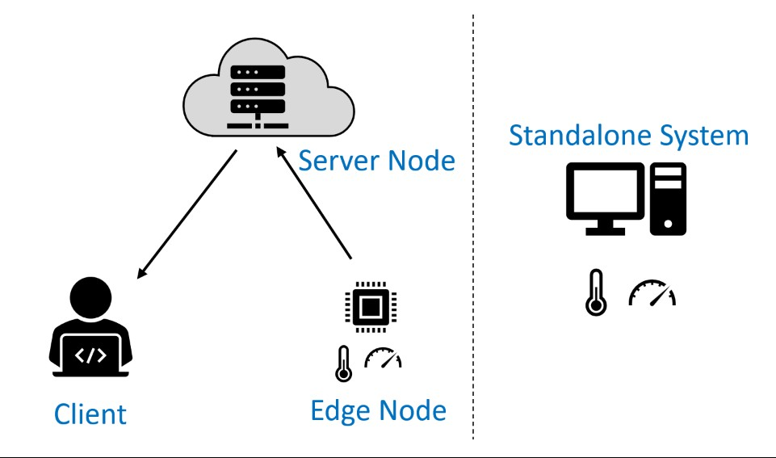

## Configuration Options

This guide provides instructions for installing one or more components of the Wattsworth stack. The choice of
components and their configuration depends on your use case:



!!! NOTE

    These configurations have been tested on [Ubuntu 24.04](https://releases.ubuntu.com/24.04/). Other Linux distributions should be compatible but may require minor changes to the following instructions.

* **Standalone System**: A complete self hosted Wattsworth setup. Capture data from sensors and visualize on a locally hosted instance of Lumen. Ideal for evaluating Wattsworth or remote sites without network connectivity.
* **Edge Node**: A dedicated data capture system running Joule. Typically a single board computer like the Raspberry Pi. Data can be stored locally or replicated to a server node. 
* **Server Node**: A central repository for archived data from edge nodes and a shared Lumen instance for remote users (clients). Can be hosted on a cloud service like AWS or run on local hardware with appropriate connectivity.
* **Client**: An end user laptop or workstation. Uses a local copy of Joule to interact with data on remote nodes and a web browser to access the associated Lumen server(s).

The table below lists the components required for each type of installation:

|                 | [Pre-Reqs](#prerequisites) |[Joule](#install-joule) | [Lumen](#install-lumen)  | [Nginx](#install-nginx) |
| --------------: | :--------------: | :---------: | :-------: | :---------: |
| **Standalone**  | :material-check: | system      | container | Joule+Lumen |
| **Server Node** | :material-check: | container   | container | Joule+Lumen |
| **Edge Node**   | :material-check: | system      |           | Joule       |
| **Client**      |                  | virtual-env |           |             |

## Prerequisites


### Docker {: #install-docker }

Install docker using the instructions for your OS available on <https://docs.docker.com/engine/install/>. The script
below should work on most OS distributions but is not generally recommend for production systems.


```{.bash title="SHELL" .copy}
sudo apt update && sudo apt install -y curl
curl -sSL https://get.docker.com | sh
```

### TimescaleDB {: #install-tsdb }

Joule stores data in a TimescaleDB database. Create the files below and then run the following commands to install TimescaleDB
in a [docker](#install-docker) container. The first file is a docker-compose file that will create a docker container running TimescaleDB. The second file is a systemd service file that
automatically starts the container when the system boots.  If you already have a TimescaleDB instance you can skip this step.
If you plan to use this system in production consider changing the ``POSTGRES_PASSWORD`` environment variable to a more secure value.

=== "Docker Compose File"
    ```{.yaml .copy title="/opt/timescaledb/docker-compose.yml"}
    version: "3.9"
    services:
      postgres:
        image: timescale/timescaledb:2.11.2-pg15
        restart: always
        environment:
          POSTGRES_USER: joule
          POSTGRES_PASSWORD: joule
          POSTGRES_DB: joule
        volumes:
        - /opt/timescaledb/data:/var/lib/postgresql/data  # persist data
        ports:
        - 127.0.0.1:5432:5432
    ```

=== "Unit File"
    ```{.systemd .copy title="/etc/systemd/system/timescaledb.service"}
    [Unit]
    Description=TimescaleDB
    After=docker.service

    [Service]
    Type=simple
    WorkingDirectory=/opt/timescaledb
    ExecStart=/usr/bin/docker compose up
    ExecStop=/usr/bin/docker compose down
    Restart=always
    RestartSec=10

    [Install]
    WantedBy=multi-user.target
    ```

After creating the files above, run the following commands to start the TimescaleDB container and configure it to start on system boot.

```{.bash .copy title="SHELL"}
sudo systemctl enable timescaledb.service
sudo systemctl start timescaledb.service

# track container installation progress (Ctrl-C to exit)
sudo journalctl -u timescaledb.service -f
```

Wait until you see a log message similar to the following before continuing:

 ``postgres-1  | LOG:  database system is ready to accept connections``


## Joule {: #install-joule}

Joule is divided into a client `joule` and server `jouled`. The client can be installed on any 
standard OS with Python 3.11 or greater. The ``jouled`` server requires a Linux OS and has been tested on Ubuntu and AlmaLinux. Other distributions should work fine but may require some modifications to the configuration. The most recent version is available on [pypi](https://pypi.org/project/joule/).


### System Installation  {: #install-joule-system}

The `joule` package should be installed with pip if you plan on using the API features or
[pipx](https://pipx.pypa.io/stable/) if you plan on only using the command line interface (CLI). If you want to run the Joule server, first configure a TimescaleDB instance as described in the [prerequisites](#prerequisites) and then use the ``install.sh`` script to generate a default configuration in `/etc/joule` and the associated infrastructure to run it as a systemd service.

=== "Client"
    ```{.bash .copy title="SHELL"}
    # use joule as a client to access remote server or edge nodes
    sudo apt install pipx
    pipx install joule
    ```

=== "Server"
    ```{.bash .copy title="SHELL"}
    # configure jouled (appropriate for standalone or edge nodes)
    sudo apt install curl
    curl -sSL https://raw.githubusercontent.com/wattsworth/joule/master/install.sh | sh
    ```  
### Docker Container  {: #install-joule-container}

The Joule server may also be installed as a  [docker](#install-docker) container. When running inside a container, Joule will not be able to run
modules but this can be a useful configuration to work on archived data and is typically used on server nodes. The docker compose file below
shows a minimal configuration see [] for full details.
```{.yaml .copy title="Docker Compose File (Server)"}
version: "3.9"

  services:
    postgres:
      image: timescale/timescaledb:2.11.2-pg15
      restart: always
      environment:
        POSTGRES_USER: joule
        POSTGRES_PASSWORD: joule
        POSTGRES_DB: joule
      volumes:
        - /opt/timescaledb/data:/var/lib/postgresql/data  # persist data
    joule:
      image: wattsworth/joule:latest
      restart: always
      environment:
        # generate with [openssl rand -hex 16] or similar
        USER_KEY: ebf8d....b43c2
      ports:
        - 127.0.0.1:8181:80
```

The ``USER_KEY`` environment variable is used to
authorize the joule client. To use the container first install joule on the host (either on the system or in a virtual environment) and then run the commands below to start the container and authorize the client.

```{.bash .copy title="SHELL"}
# copy the docker compose file above to the current directory
sudo docker-compose up -d
joule node add mynode http://localhost:8181/joule ebf8d....b43c2
```

## Lumen {: #install-lumen}

Lumen provides a web frontend to visualize and interact with data collected by Joule nodes. The following instructions configure Lumen in a [docker](#install-docker) container which is suitable to run on any host OS. The container is configured with environment variables specified in the ``.env`` file. Documentation on the particular settings is contained in the sample environment file and can be used as is in most situations although changing the ``SECRET_KEY_BASE`` is recommended.

```{.bash .copy title="SHELL"}
sudo mkdir /opt/lumen && cd /opt/lumen
sudo curl -sL https://raw.githubusercontent.com/wattsworth/lumen-docker/main/docker-compose.yml -o docker-compose.yml
sudo curl -sL https://raw.githubusercontent.com/wattsworth/lumen-docker/main/sample.env -o .env
```

Create the service file below and then run the following commands to configure Lumen to start on system boot.

```{.systemd .copy title="/etc/systemd/system/lumen.service"}
[Unit]
Description=Lumen
After=docker.service

[Service]
Type=simple
WorkingDirectory=/opt/lumen
ExecStart=/usr/bin/docker compose up
ExecStop=/usr/bin/docker compose down
Restart=always
RestartSec=10

[Install]
WantedBy=multi-user.target
```

```{.bash .copy title="SHELL"}
sudo systemctl enable lumen.service
sudo systemctl start lumen.service

# track container installation progress (Ctrl-C to exit)
sudo journalctl -u lumen.service -f
```

The initial set up for this container can take several minutes.
Wait until you see a log message similar to the following which indicates the
web application is running before continuing:

```lumen-lumen-1 | [...omitted...]: Passenger core online, PID 54```

## Nginx {: #install-nginx}

[Nginx](https://nginx.org/) is a reverse proxy webserver that is used to provide external access to both Lumen and Joule. The following commands
install Nginx, remove the default site and install the configuration files for Lumen and Joule. These files are referenced
in the site configuration file. If only using Lumen, you may omit the Joule configuration file and vice versa. The ``adduser``
command grants Nginx access to the Joule socket file, it is only needed if running Joule.

```{.bash .copy title="SHELL"}
sudo apt-get install nginx -y
sudo rm /etc/nginx/sites-enabled/default

# common configuration
sudo curl -sL https://raw.githubusercontent.com/wattsworth/lumen-docker/main/host/wattsworth-maps.conf -o /etc/nginx/conf.d/wattsworth-maps.conf

# lumen specific configuration
sudo curl -sL https://raw.githubusercontent.com/wattsworth/lumen-docker/main/host/lumen.conf -o /etc/nginx/lumen.conf

# joule specific configuration
sudo curl -sL https://raw.githubusercontent.com/wattsworth/lumen-docker/main/host/joule.conf -o /etc/nginx/joule.conf

# grant Nginx access to joule, omit if only using lumen
sudo adduser www-data joule
```

Select one of the configuration files below and modify the ``server_name`` to match your domain. No additional configuration
is required to host an HTTP site. To host the site on HTTPS, you will need a valid SSL certificate and
modify the configuration file to include the certificate and key files. If Lumen is configured to host applications on
subdomains (see documentation in ``/opt/lumen/.env``), you will need a CNAME DNS record mapping ``*.app.<yourdomain>`` to ``<yourdomain>`` and for HTTPS you will need a wildcard certificate for ``*.app.<yourdomain>``.


=== "HTTP"
    ```{.nginx .copy  title="/etc/nginx/sites-enabled/wattsworth.conf"}
    server{
        listen 80;

        # server_name directive is optional, but recommended

        # Include one or both statements below to enable lumen and/or joule
        include "/etc/nginx/lumen.conf";
        include "/etc/nginx/joule.conf";
    }
    ```

=== "HTTPS"
    ```{.nginx .copy title="/etc/nginx/sites-enabled/wattsworth.conf"}
    server{
        listen 80; # redirect http traffic to https
        return 301 https://$host$request_uri;
    }

    server{
        listen 443 ssl;
        # Change server name to match your domain
        # include *.app if using subdomain apps configuration
        server_name example.wattsworth.net *.app.example.wattsworth.net;

        # Include one or both statements below to enable lumen and/or joule
        include "/etc/nginx/lumen.conf";
        include "/etc/nginx/joule.conf";

        # Security configuration
        # Note: For subdomain apps this must include wildcard *.app.<yourdomain>
        ssl_certificate fullchain.pem;
        ssl_certificate_key privkey.pem;
    }
    ```


Finally, restart Nginx to reflect the new configuration:

```{.bash .copy title="SHELL"}
sudo systemctl restart nginx
```

Continue to [Quick Start](quick_start.md) to start using Wattsworth.
