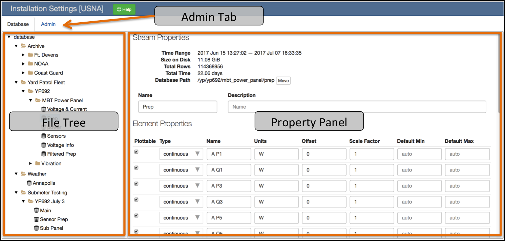
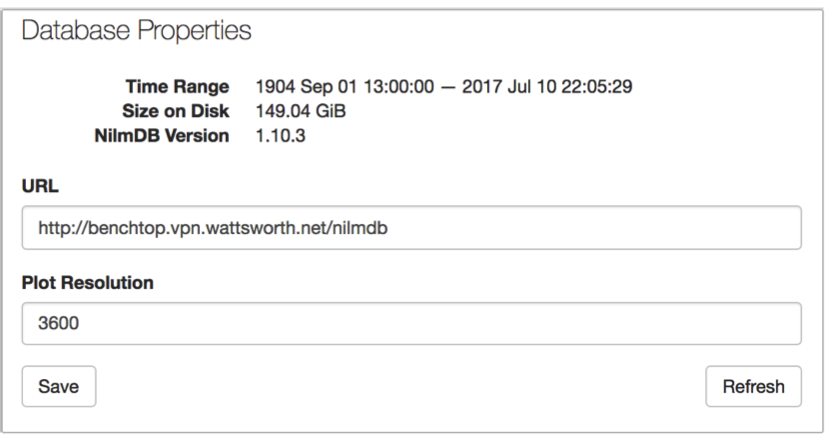
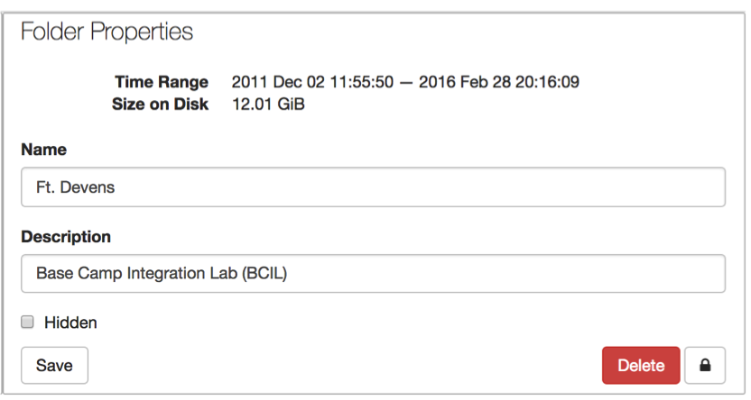
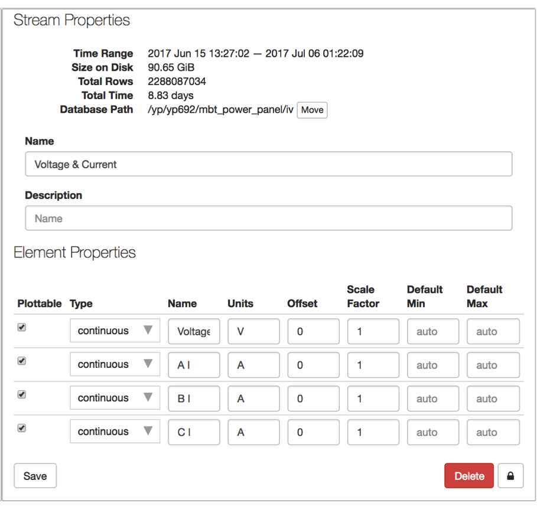
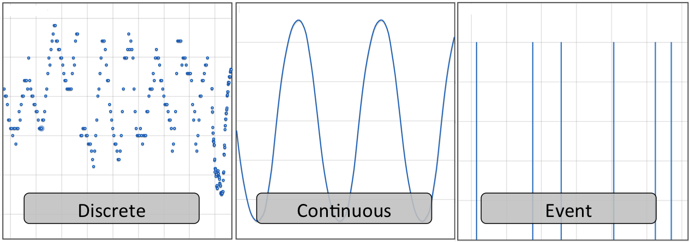
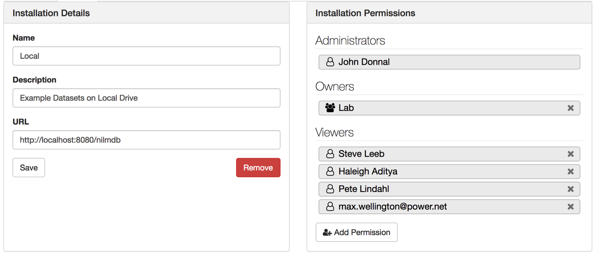
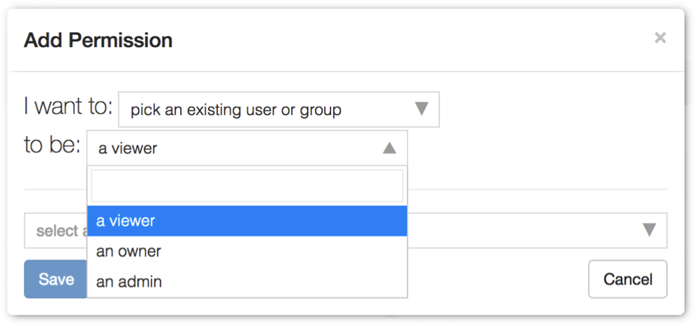
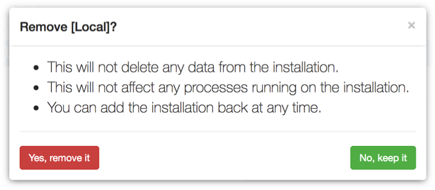

# Installation Settings

## File Tree

When the page is loaded only the installation database and root folders are
listed. Click the :fontawesome-solid-caret-right: icon to expand or collapse a folder. Folders
contain data streams and/or subfolders. Select an item to display it in the
Property Panel. You may display the :ref:`installation-database`, a
:ref:`installation-folder`, or a :ref:`installation-stream`.

## Property Panel

The property panel lists the attributes and settings for the currently selected
item in the File Tree.

### Database

The **Plot Resolution** is the maximum number of data points
this installation will return. If you request an interval of data that has more
samples than this value, a decimated copy of the data will be returned. This setting
applies to plots and data downloads.

**Refresh** reloads the installation database. You must refresh the database
when you add or remove streams on the remote installation. This operation may
take a while to complete.

Do not change the URL, this feature is currently unsupported.

### Folder

### Data Stream

## Admin Tab

{ width="400"}

{ width="400"}
