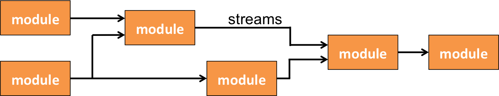

## Joule

Joule decentralizes signal processing into discrete **modules**. These
modules are connected by **streams** as shown in the figure below. The
interconnection of modules and streams form a data **pipeline**. A pipeline may execute
as a single proces, a collection of processes, or even be distributed
across multiple nodes in a network without adjusting any module code.

   Joule **pipelines** are composed of **modules** and **streams**

## Lumen
TODO